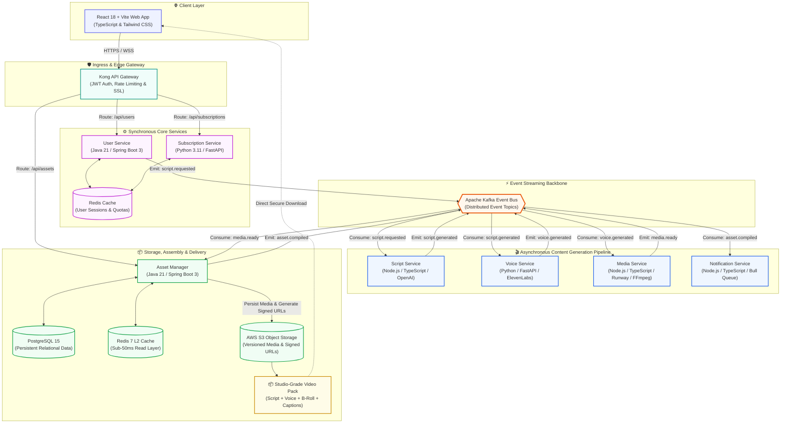
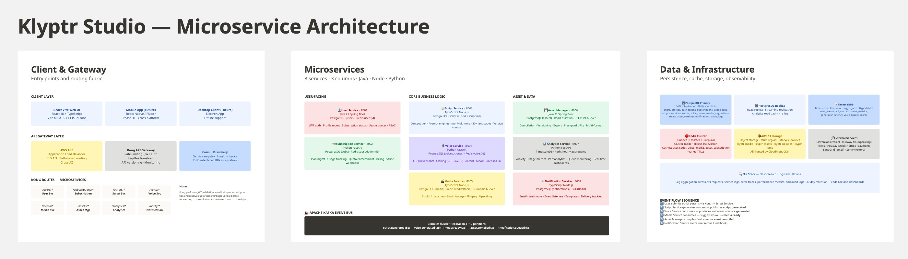
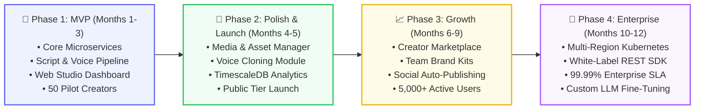

<div align="center">

# 🎬 Klyptr Studio
### The AI-Powered Modular Content Engine for Tech Creators & Professionals

<p align="center">
  <b>Turn raw ideas into studio-grade video assets in under 15 minutes.</b><br/>
  Scripting • Voice Synthesis • Contextual B-Roll • Dynamic Captions • Automated Assembly
</p>

[](LICENSE)
[](https://github.com/Klyptr-Studio)
[](https://github.com/Klyptr-Studio)
[](https://github.com/Klyptr-Studio)

<br/>

<!-- GitHub Achievements Showcase -->
<table>
  <tr>
    <td align="center" width="16%">
      <a href="https://githubachievements.com/#galaxy-brain">
        <br/>
        <sub><b>Galaxy Brain</b></sub>
      </a>
    </td>
    <td align="center" width="16%">
      <a href="https://githubachievements.com/#pair-extraordinaire">
        <br/>
        <sub><b>Pair Extraordinaire</b></sub>
      </a>
    </td>
    <td align="center" width="16%">
      <a href="https://githubachievements.com/#pull-shark">
        <br/>
        <sub><b>Pull Shark</b></sub>
      </a>
    </td>
    <td align="center" width="16%">
      <a href="https://githubachievements.com/#quickdraw">
        <br/>
        <sub><b>Quickdraw</b></sub>
      </a>
    </td>
    <td align="center" width="16%">
      <a href="https://githubachievements.com/#starstruck">
        <br/>
        <sub><b>Starstruck</b></sub>
      </a>
    </td>
    <td align="center" width="16%">
      <a href="https://githubachievements.com/#public-sponsor">
        <br/>
        <sub><b>Public Sponsor</b></sub>
      </a>
    </td>
  </tr>
</table>

<br/>

</div>

---

## ⚡ Executive Summary

Traditional short-form and educational video production is notoriously fragmented: drafting scripts, recording pristine voiceovers, hunting for contextual B-roll, keyframing animations, and syncing captions easily consumes **1 to 2 weeks per clip**. For introverted domain experts, camera-shy engineers, and busy founders, this high-friction production loop is the single largest bottleneck to audience growth.

**Klyptr Studio** replaces that manual overhead with an **enterprise-grade, event-choreographed microservices platform**. By orchestrating specialized LLMs, state-of-the-art neural voice synthesis (MOS > 4.0), and semantic media intelligence, Klyptr delivers **production-ready modular assets in 10 to 15 minutes end-to-end**.

Creators enjoy full hybrid flexibility:
- 💡 **AI Script + Own Voiceover**
- 🎙️ **Own Script + Neural Voice Synthesis**
- ⚡ **Zero-to-One Autonomous Assembly**

---

## 🏗️ System Architecture & Data Flow

Klyptr Studio is architected around an **event-driven choreography pattern** powered by **Apache Kafka**, with high-performance edge routing via **Kong API Gateway** and a unified multi-tier caching layer (Redis L2 + PostgreSQL persistent storage).



<div align="center">
  
  <br/>
  <sub><i>Figure 1: Event-driven choreography and microservices data pipeline</i></sub>
</div>

<br/>

### 🔄 Data Flow Lifecycle

#### ✍️ Write Path (Autonomous Generation)
1. **User Request:** Creator submits project parameters (topic, language, tone, voice preferences) via the **React 18 Web Studio**.
2. **Auth & Quotas:** **Kong API Gateway** routes to **User Service** for JWT verification and **Subscription Service** for real-time quota validation.
3. **Event Ingestion:** **User Service** writes job metadata to PostgreSQL and publishes `script.requested` to the **Apache Kafka Event Bus**.
4. **Script Generation:** **Script Service** consumes the event, invokes OpenAI with custom tone templates, stores the script, invalidates `script:{userId}` cache, and emits `script.generated`.
5. **Voice Synthesis:** **Voice Service** consumes `script.generated`, synthesizes audio via ElevenLabs or GPT-SoVITS (MOS > 4.0), caches the audio vector, and emits `voice.generated`.
6. **Media Intelligence:** **Media Service** consumes `voice.generated`, ranks contextual B-roll clips and AI imagery via Runway ML & stock footage APIs, and emits `media.ready`.
7. **Asset Assembly:** **Asset Manager** downloads media parts, encodes timeline assets, uploads to AWS S3, and emits `asset.compiled`.
8. **Notification:** **Notification Service** consumes `asset.compiled` and triggers real-time UI webhooks and email notifications.

#### 📖 Read Path (Sub-50ms Delivery)
1. Client requests project assets via `GET /api/assets/{projectId}`.
2. **Kong API Gateway** routes directly to **Asset Manager**.
3. **Asset Manager** performs an L2 cache lookup:
   - **Cache Hit:** Returns cached metadata and pre-signed S3 URLs immediately.
   - **Cache Miss:** Reads from PostgreSQL, repopulates Redis with a 2-hour TTL, and generates secure, pre-signed AWS S3 download URLs.

#### ⚡ Cache Invalidation Strategy
- **Script Changes:** Invalidate `script:{userId}` and `script:{projectId}`.
- **Voice Changes:** Invalidate `voice:{voiceId}` and audio cache vectors.
- **Media Suggestions:** Invalidate `media:suggestions:{topicId}`.

---

## 🧩 Microservices Ecosystem

Every service is developed following domain-driven design, equipped with its own containerized PostgreSQL instance, Redis cache, isolated integration tests, and multi-stage Docker build pipeline:

| Service | Responsibility | Technology Stack | Primary Data Store | Cache & Queue |
| :--- | :--- | :--- | :--- | :--- |
| **[`User-Service`](https://github.com/Klyptr-Studio/User-Service)** | Identity, JWT OAuth2, user profiles & team workspaces | `Java 21` `Spring Boot 3` | PostgreSQL 15 | Redis 7 |
| **[`Script-Service`](https://github.com/Klyptr-Studio/Script-Service)** | Prompt engineering, multi-language translation & tone steering | `TypeScript` `Node.js` `OpenAI` | PostgreSQL 15 | Redis 7 • Kafka |
| **[`Voice-Service`](https://github.com/Klyptr-Studio/Voice-Service)** | Neural TTS, consent-driven voice cloning & MOS QA scoring | `Python 3.11` `FastAPI` | PostgreSQL 15 | Redis 7 • Kafka |
| **[`Media-Service`](https://github.com/Klyptr-Studio/Media-Service)** | Semantic B-roll ranking, AI image upscaling & FFmpeg pipelines | `TypeScript` `Node.js` `Runway` | PostgreSQL 15 + AWS S3 | Redis 7 • Kafka |
| **[`Asset-Manager`](https://github.com/Klyptr-Studio/Asset-Manager)** | Timeline compilation, export encoding & asset lifecycle versioning | `Java 21` `Spring Boot 3` | PostgreSQL 15 + AWS S3 | Redis 7 • Kafka |
| **[`Subscription-Service`](https://github.com/Klyptr-Studio/Subscription-Service)**| Stripe webhook automation, plan quotas & usage guardrails | `Python 3.11` `FastAPI` | PostgreSQL 15 | Redis 7 |
| **[`Analytics-Service`](https://github.com/Klyptr-Studio/Analytics-Service)** | Time-series ingestion, user retention & generation latency | `Python 3.11` `FastAPI` | TimescaleDB | Redis 7 • Kafka |
| **[`Notification-Service`](https://github.com/Klyptr-Studio/Notification-Service)**| Real-time push, async job queues & transactional emails | `TypeScript` `Node.js` `SendGrid`| PostgreSQL 15 | Bull Queue • Redis |

---

## 🛠️ Developer Tooling & Starter Templates

To enforce consistency across polyglot microservice boundaries, Klyptr Studio maintains production-grade starter templates and CLI automation:

```
klyptr-studio/
├── ☕ template-springboot-microservice   ── Spring Boot 3.2, Java 21, JPA, Redis, Docker
├── 🐍 template-python-microservice       ── FastAPI, SQLAlchemy 2.0 Async, Pydantic v2
├── 🟩 template-nodejs-microservice       ── Express, TypeScript, pg.Pool, Zod, Vitest
└── ⚛️ template-react-microservice        ── React 18, Vite, TypeScript, Tailwind CSS
```

### Instant Service Scaffolding via CLI
Initialize and register any new microservice in seconds with our unified initializer:
```bash
# Scaffold and push a new microservice instantly
init-klyptr-studio-microservice python "Billing Engine"
init-klyptr-studio-microservice nodejs "Thumbnail Service"
init-klyptr-studio-microservice springboot "Audit Log Service"
init-klyptr-studio-microservice react "Creator Studio Web"
```

---

## 🎯 Non-Functional Specifications & SLA

```
┌──────────────────────────────────────┬──────────────────────────────────────┐
│ Metric / SLA                         │ Target Specification                 │
├──────────────────────────────────────┼──────────────────────────────────────┤
│ End-to-End Asset Generation Latency  │ < 2 Minutes (Script to Final Pack)   │
│ Service API Availability             │ 99.9% Production Uptime SLA          │
│ Script Generation Success Rate       │ > 95% First-Pass Acceptance          │
│ Neural Voice Quality (MOS Score)     │ > 4.0 (Parity with ElevenLabs)       │
│ Peak Concurrency Support             │ 1,000+ Concurrent Generation Streams │
│ Encryption Standards                 │ AES-256 (At Rest), TLS 1.3 (Transit) │
│ Regulatory Compliance                │ DPDP Act 2023 (India) & GDPR Ready   │
└──────────────────────────────────────┴──────────────────────────────────────┘
```

---

## 🗺️ Product Roadmap



---

## 🛡️ Security, Privacy & Compliance

- **Consent-Driven Voice Cloning:** Strict cryptographic voice sample verification ensuring non-repudiation and compliance with the **Digital Personal Data Protection (DPDP) Act 2023** and **GDPR**.
- **Data Sovereignty & Right to Erasure:** Complete programmatic deletion guarantees across Redis caches, PostgreSQL metadata, and S3 audio vectors.
- **Copyright Sanitization:** Commercial-use stock licensing integration paired exclusively with original synthetic outputs to insulate creators from copyright strikes.

---

## 🤝 Engineering Community & Contributions

Klyptr Studio thrives on engineering excellence, rigorous review standards, and open collaboration.

<div align="center">

[](https://githubachievements.com/)
[](https://github.com/Klyptr-Studio)

<br/>

<sub>Built with ❤️ by the <b>Klyptr Studio Engineering Team</b> • © 2026 Klyptr Studio. All rights reserved.</sub>

</div>
