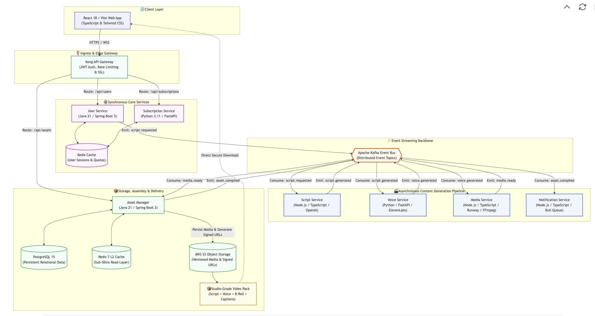
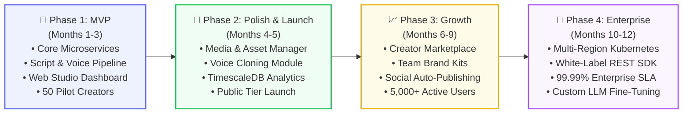
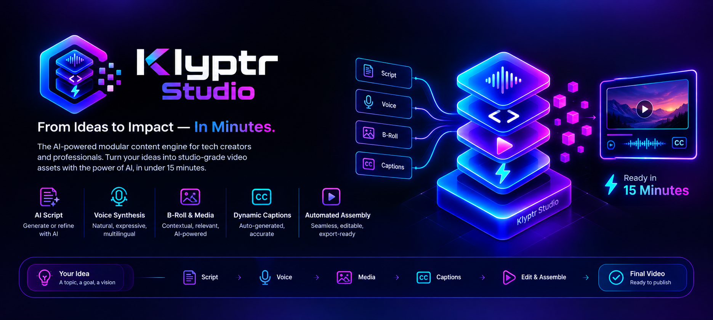

# Klyptr Studio
### The AI-Powered Modular Content Engine for Tech Creators & Professionals

  <b>Turn raw ideas into studio-grade video assets in under 15 minutes.</b> 
  Scripting • Voice Synthesis • Contextual B-Roll • Dynamic Captions • Automated Assembly

 

---

## Executive Summary

Traditional short-form and educational video production is notoriously fragmented: drafting scripts, recording pristine voiceovers, hunting for contextual B-roll, keyframing animations, and syncing captions easily consumes **1 to 2 weeks per clip**. For introverted domain experts, camera-shy engineers, and busy founders, this high-friction production loop is the single largest bottleneck to audience growth.

**Klyptr Studio** replaces that manual overhead with an **enterprise-grade, event-choreographed microservices platform**. By orchestrating specialized LLMs, state-of-the-art neural voice synthesis (MOS > 4.0), and semantic media intelligence, Klyptr delivers **production-ready modular assets in 10 to 15 minutes end-to-end**.

Creators enjoy full hybrid flexibility:
- **AI Script + Own Voiceover**
- **Own Script + Neural Voice Synthesis**
- **Zero-to-One Autonomous Assembly**

---

## System Architecture & Data Flow

Klyptr Studio is architected around an **event-driven choreography pattern** powered by **Apache Kafka**, with high-performance edge routing via **Kong API Gateway** and a unified multi-tier caching layer (Redis L2 + PostgreSQL persistent storage).

 

## Microservices Ecosystem

Every service is developed following domain-driven design, equipped with its own containerized PostgreSQL instance, Redis cache, isolated integration tests, and multi-stage Docker build pipeline:

| Service | Responsibility | Technology Stack | Primary Data Store | Cache & Queue |
| :--- | :--- | :--- | :--- | :--- |
| **[`User-Service`](https://github.com/Klyptr-Studio/User-Service)** | Identity, JWT OAuth2, user profiles & team workspaces | `Java 21` `Spring Boot 3` | PostgreSQL 15 | Redis 7 |
| **[`Script-Service`](https://github.com/Klyptr-Studio/Script-Service)** | Prompt engineering, multi-language translation & tone steering | `TypeScript` `Node.js` `OpenAI` | PostgreSQL 15 | Redis 7 • Kafka |
| **[`Voice-Service`](https://github.com/Klyptr-Studio/Voice-Service)** | Neural TTS, consent-driven voice cloning & MOS QA scoring | `Python 3.11` `FastAPI` | PostgreSQL 15 | Redis 7 • Kafka |
| **[`Media-Service`](https://github.com/Klyptr-Studio/Media-Service)** | Semantic B-roll ranking, AI image upscaling & FFmpeg pipelines | `TypeScript` `Node.js` `Runway` | PostgreSQL 15 + AWS S3 | Redis 7 • Kafka |
| **[`Asset-Manager`](https://github.com/Klyptr-Studio/Asset-Manager)** | Timeline compilation, export encoding & asset lifecycle versioning | `Java 21` `Spring Boot 3` | PostgreSQL 15 + AWS S3 | Redis 7 • Kafka |
| **[`Subscription-Service`](https://github.com/Klyptr-Studio/Subscription-Service)**| Stripe webhook automation, plan quotas & usage guardrails | `Python 3.11` `FastAPI` | PostgreSQL 15 | Redis 7 |
| **[`Analytics-Service`](https://github.com/Klyptr-Studio/Analytics-Service)** | Time-series ingestion, user retention & generation latency | `Python 3.11` `FastAPI` | TimescaleDB | Redis 7 • Kafka |
| **[`Notification-Service`](https://github.com/Klyptr-Studio/Notification-Service)**| Real-time push, async job queues & transactional emails | `TypeScript` `Node.js` `SendGrid`| PostgreSQL 15 | Bull Queue • Redis |

---

## Product Roadmap

 

---

## Contributing

Repositories are currently private, but I am actively seeking collaborators to help build Klyptr Studio. If you would like to contribute for Klyptr Studio, please reach out to me via [LinkedIn](https://www.linkedin.com/in/dharmaraj-rathinavel/). 

  
Built with ❤️ by <b><a href="https://dharmaraj-rathinavel.work/">Dharmaraj</a></b>

